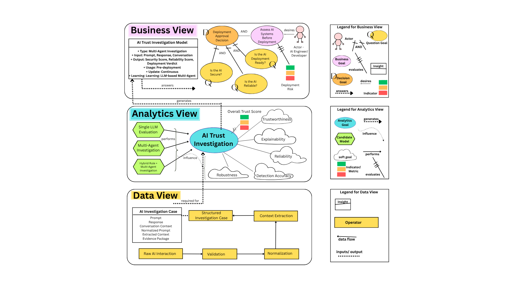
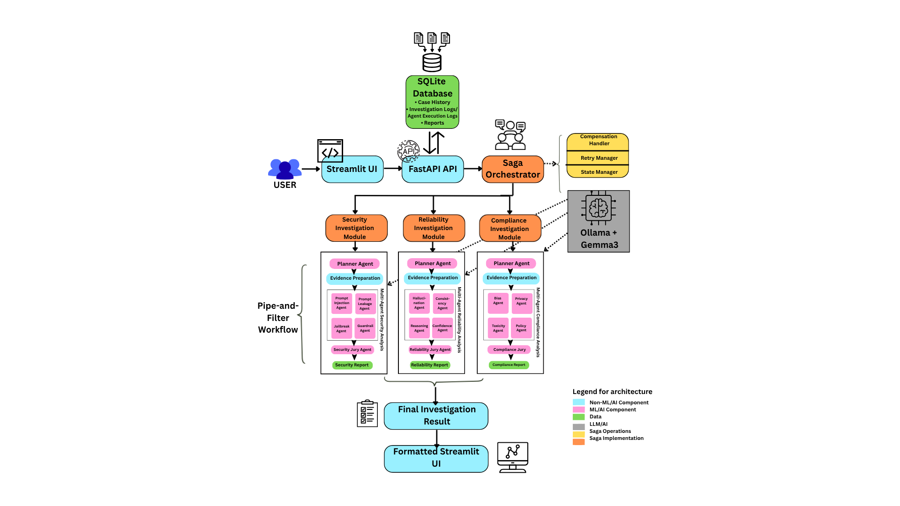

# AICop

AICop is a multi-agent AI investigation platform that evaluates the security, reliability, and trustworthiness of AI systems.

## 📐 System Design

The complete architectural design and GR4ML requirement models for **AICop – AI Trust Investigation Platform** are included below.

---

## GR4ML Requirement Models

The GR4ML models define the system requirements using:

- Business View
- Analytics Design View
- Data Preparation View

### Repository

`architecture/gr4ml.png`



**Interactive Canva:**  
https://canva.link/pxp1kstojwci9du

---

## System Architecture

The architecture demonstrates:

- Saga Orchestration Pattern
- Pipe-and-Filter Pattern
- ML and Non-ML component separation
- Multi-agent Security, Reliability, and Compliance workflows
- Streamlit, FastAPI, SQLite, and Ollama (Gemma 3) integration

### Repository

`architecture/architecture.png`



**Interactive Canva:**  
https://canva.link/7prpyi6xpcjexpe


## What is included
- FastAPI backend with investigation endpoints
- LangGraph-style orchestrator with planner, security, reliability, evaluator, and report agents
- SQLite persistence for investigation cases
- Streamlit frontend for running investigations and viewing reports
- PDF report generation support

## Run the backend
```bash
python -m uvicorn backend.main:app --host 0.0.0.0 --port 8000
```

## Run the frontend
```bash
streamlit run frontend/app.py
```

## Verify the API
```bash
curl http://127.0.0.1:8000/health
```


